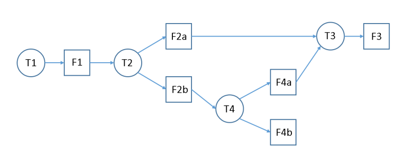
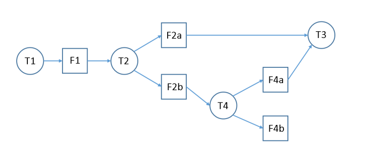

---
Towards a Good Future
---

Document number: P0676R0

Date: 2017-06-18

Audience: Library Working Group

Reply-to:  Felix Petriconi felix{at}petriconi[dotnet], David Sankel camior{at}gmail[dotcom], Sean Parent sean.parent{at}gmail[dotcom]

This version of the document is available [online](https://github.com/FelixPetriconi/future_proposal/tree/v1.1/proposal.md)

# I. Table of Contents
 * [I. Table of Contents](#i-table-of-contents)
 * [II. Introduction](#ii-introduction)
 * [III. Motivation and Scope](#iii-motivation-and-scope)
    * [Copyable future](#copyable-future)
    * [Cancellation of futures](#cancellation-of-futures)
    * [Simplified interface](#simplified-interface)
    * [Zero and Multi-Valued Futures](#zero-and-multi-valued-futures)
    * [Simplifying Future Creation](#simplifying-future-creation)
    * [Scalability](#scalability)
    * [Executors](#executors)
    * [Joins](#joins)
 * [IV. Impact On the Standard](#iv-impact-on-the-standard)
 * [V. Acknowledgments](#v-acknowledgments)

# II. Introduction

The standard library needs a high-quality vocabulary type to represent asynchronous values. Having many variations of this concept in the wild is a pain point, but, even worse, the judicious use of "callback soup" makes asynchronous code difficult to develop and maintain. Unfortunately, based on the experience of the authors in real-world, production applications, neither the crippled `std::future`, nor the extensions proposed in the Concurrency TS are going to remedy the situation.

In the negative, we recommend against adoption of the `std::future` related extensions in the C++17 Concurrency TS. In the positive, we provide recommendations for an alternative that we feel will meet the demands of real world applications and, more importantly, gain widespread adoption. The features we propose are based on a combination of characteristics of [Adobe stlab's future](http://www.stlab.cc/libraries/concurrency/future/future/) and [Bloomberg dplp's promise](https://github.com/camio/dpl/blob/master/dplp/dplp_promise.h). The latter was presented at C++Now 2017 in [The Mathematical Underpinnings of Promises in C++](https://www.youtube.com/watch?v=2OY0Zn3oBCE) and [Promises in C++: The Universal Glue for Asynchronous Programs](https://www.youtube.com/watch?v=pKMZjd9CFnw).

# III. Motivation and Scope

## Copyable future

A common use case in graphs of execution is that the result of an asynchronous calculation is needed as an argument for more than one further asynchronous operation. The current design of `std::future` is limited to one continuous operation, to one `.then()`, because it accepts only an rvalue `std::future` as argument. So the `std::future` must be moved into the continuation and after that it cannot be used as an argument for an other continuation.

The support of a split would close the current gab in symmetry of the interface design by the C++17 TS, that only specifies a join.

So it is necessary that futures become copyable and the following example of multiple continuations into different directions would be possible. 

~~~C++
   future<int> a;
   a.then([](int x){ /* do something */ });
   a.then([](int x){ /* also do something else. */ }
~~~

If any of the future type arguments are move only, then the future itself is move only, and may only have a single continuation. A future which is an rvalue also may only have a single continuation attached and this allows optimization to avoid unnecessary copies of values passed to continuations.

## Cancellation of futures

For various reasons, the result of an asynchronous operation and its continuations may no longer be needed during the course of execution; e.g. the application's user has canceled an operation, or a subsequent operation replaces the result or yields it unnecessary. The current design of `std::future` and the TS does not support any kind of cancellation. Instead, it is required to wait for a future's fulfillment even when the result is not needed anymore. This is a waste of resources, especially on e.g. mobile devices.
Even if it were possible to implement cancellation on top of the existing design, it would be preferable for futures to have this capability built-in. 

We think it necessary that a future can be "destructed" before it starts execution of its associated task. In case that it has started, it should finish, but the result would be dropped and the attached continuations should not be executed.

In the following an exemplary use case illustrates how the cancellation of a future flows back through the graph. Tasks, indicated as circles, and futures, indicated as squares, build here a dependency graph of execution.

   

In case that one is not interested any more in future F3, it gets destructed. Then the graph would become:

 

Now there is no need to execute task T3 and so it will automatically be dropped as well and the graph would change to:


Now the futures F2a and F4a are obsolete and they go away as well.


And so the reduced graph remains.


## Simplified interface

According to the C++17 TS, `std::future`'s `then` member function has a single argument (called a continuation) that is invoked with a `std::future<T>` object:

~~~C++
  std::future<int> getTheAnswer = std::async([]{ return 42; };
  auto next = getTheAnswer.then([](std::future<int> x) { std::cout << x.get(); };
~~~

The passed `std::future` object is in a completed state (e.g. already fulfilled with a value or rejected with an exception) when the continuation is called.  While this is a clever way to communicate the fulfilled or rejected value to the continuation, use of the future object as a "value or error" object instead of its primary purpose (a potentially *future* value or error) is confusing.

The problem is exacerbated when `then` is called on the result of a `when_all` operation. Its continuation must be called with a `future<tuple<future<Args>...>>` argument. (In the following example a possible parameter declaration of "auto x" is written explicitly for clarification.)

~~~C++
  std::future<int> an = std::async([]{ return 40; });
  std::future<int> swer = std::async([]{ return 2; });
  
  auto answer = std::when_all(std::move(an), std::move(swer)).then( 
    [](std::future<std::tuple<std::future<int>, std::future<int>>> x) {
      std::tuple<std::future<int>, std::future<int>> t = x.get();
      std::cout << get<0>(t).get() + get<1>(t).get();
    });
~~~

This code is difficult to reason about. First, the tuple must be extracted from the future and then all values for the actual calculation of the continuation must be accessed through the tuple and then through the futures.  So either the interface of the callable operation gets "infected" by the interface of `std::future` or an additional layer of extraction is necessary to invoke the operation.  Both choices are not optimal from our point of view and they can be avoided by instead calling the continuations by value.

So the code could then be written like this:

~~~C++
  future<int> an = async([]{ return 40; });
  future<int> swer = async([]{ return 2; });
  
  auto answer = when_all(an, swer).then( 
    [](int x, int y) {
      std::cout << x + y;
    });
~~~

One argument for passing a future to the continuation is that the future encapsulates either the real value or an exception. However, this implies that everyone has to use the more complicated interface by passing futures even when an exception cannot occur. From our point of view this is against the general principle within C++, that one should only have to pay for what one really needs.

In cases where error handling is necessary, an optional second argument to `then` can be used.

~~~C++
  auto getTheAnswer = [] {
    throw std::exception("Bad thing happened: Vogons appeared");
    return 42;
  };

  auto handleTheAnswer = [](int v) { 
    if (v == 0) 
      std::cout << "No answer\n"; 
    else
      std::cout << "The answer is " << v '\n'; 
  };

  auto f = async(default_executor, getTheAnswer)
    .then(
      [](int result) { return result; },
      [](const std::exception_ptr & error) {
        std::cout << "Listen to Vogon poetry!\n";
        return 0;
      })
    .then(handleTheAnswer);
~~~

## Zero and Multi-Valued Futures

In the snippet above, reproduced below, what is the type of `when_all(an, swer)`?

~~~C++
  future<inr> an = async([]{ return 40; });
  future<int> swer = async([]{ return 2; });
  
  auto answer = when_all(an, swer).then( 
    [](int x, int y) {
      std::cout << x + y;
    });
~~~

We propose that its type should be `future<int, int>`. Extending `future`'s with the ability to carry multiple types has a great convenience due to how `then` is used. To create a multi-valued future, one can use `when_all` or return a `std::tuple` object in a continuation.

What should the type be of `answer` above? We propose that instead of using the `void` keyword as a special case, we instead use `future<>` to represent a future that carries no values. This has a great harmony with how continuation functions are specified.

## Simplifying Future Creation

Creating a future that isn't based on another future is done via first creating a `std::promise` object. Conversion of an asynchronous function to a `future`-returning function is accomplished as follows: 

~~~C++
  std::future<int> wrappedF() {
    std::promise<int> p;
    std::future<int> result = p.get_future();
    f([p = std::move(p)](int i) mutable { p.set_value(i); });
    return result;
  }
~~~

The dance required to accomplish this is difficult to follow and explain, especially for intermediate C++ developers. Making `std::future`'s constructor take in a resolver function simplifies this common operation.

~~~C++
  future<int> wrappedF() {
    return future( [](auto resolve, auto reject) {
        f(resolve);
    });
  }
~~~

---

The STLab currency library takes a different approach. Conceptually, a future is a token used to separate the result of a function from the invocation of the function. The invocation portion of the function is referred to as the task. The code that separates these two components is referred to a package:

```cpp
  auto [task, result] = package([](int x){ return x * 2; });
  result.then([](int x){ cout << x << endl; }
  task(4);
```
Will print:
```
  8
```

This pattern can be used with a trivial function to convert a packaged task into a simple promise:

```cpp
  auto [promise, result] = package([](int x){ return x; }); // identity function
```

`package()` establishes a root for a dependency tree. There are 3 pieces of information that can be communicated through this root. The value or exception flow from the task to the future, and cancellation flows from future to task. All of this information is available through this interface, though the interface is biased towards simple values:

```cpp
  template <class F>
  class cancel_notifer {
     optional<F> _f;
  public:
     cancel_notifer(F f) : _f(move(f)) { }
     ~cancel_notifer() { if (_f) _f.get()(); }
     void reset() { _f.reset(); }
  };


  auto [task, result] = package([_notifier = cancel_notifier([] {
     cout << "was canceled" << endl;
  })](variant<value_type, exception_ptr> x) {
     _notifier.reset();
     if (auto p = x.get_if<exception_ptr>()) return rethrow_exception(*p);
     return move(x).get<value_type>();
  });
```

## Scalability 

It is necessary that futures scale in the same way from single threaded to multi threaded environments. So either it it necessary to get rid of `.get()` and `.wait()` or define when and how tasks can be promoted to immediate (inline) execution and support `.get()` and `.wait()` in such circumstances without blocking. 

Note that `.get()` and `.wait()` as they are currently defined are potential deadlocks in any system without unlimited concurrency (i.e., in any real system).

We propose that these be made into free functions with names that better indicate the potential danger.

##  Executors

Many of today's UI libraries allow changes of the UI elements only from within the main-event-loop or main-thread. However, the design of std::async and the continuations of C++11 and the C++17 TS it is not easily possible to perform changes in the UI, because it is not possible to define in which thread a future or a continuation shall be executed.

To remedy this, we propose that it should be possible to specify an executor while using `async` or `package` to create a new future or pass it as additional argument when calling a continuation.

Example:

~~~C++
  future<int> calculateTheAnswer = async(std::default_executor, []{ return 42; } );
  
  future<void> displayTheAnswer = 
    calculateTheAnswer.then( QtMainLoopExecutor{}, [this](int a) { _theAnswerDisplayField.setValue(a); } ); 
~~~

Here the task associated with the first future shall be executed on the default executor, which we think should be based on the system's thread pool. And then the continuation shall run on an executor that schedules all tasks to be executed within the Qt main loop.


## Joins 

As specified in the C++17 TS, there should be joins as `when_all` and `when_any`. But as already pointed out above, the attached function object should take its arguments per value and not by `future<T>`.

Now it would be possible with the support of cancellation of futures that in case of a single failing future for a `when_all`, all not started futures are canceled, because the overall `when_all` cannot be fulfilled any more. The same is valid for a `when_any`. So as soon as one future is fulfilled, all other non started futures could be canceled. `when_any` and `when_all` are special cases of a more general `when_n`.

# IV. Impact On the Standard

Rather than attempting to "fix" the current `std::future`, we suggest that a better designed future be put into `std` or `std2`.

# V. Acknowledgments

We thank Gor Nishanov for encouraging us in pursuing with this proposal and for sharing his thought. Related conversations with Bryce Lebach have also been tremendously helpful.
